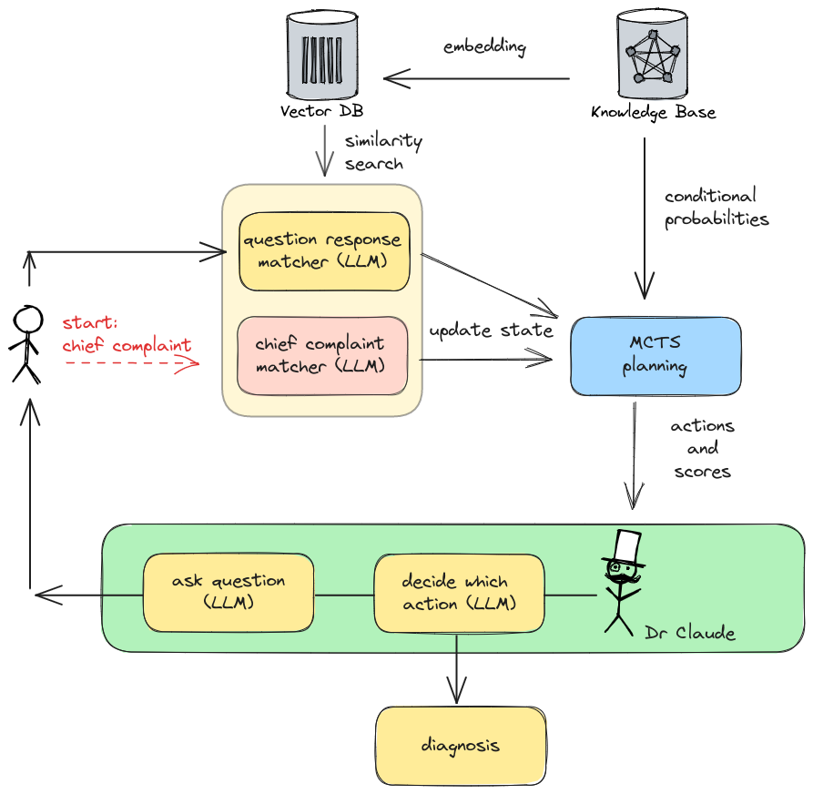

# dr-claude

A Next Best Action Engine to help healthcare professionals "pathfind" towards the most accurate diagnosis in the shortest possible time, optimizing patient outcomes and resource utilization. Combines the power of symbolic reasoning (AlphaGo-style MCTS) with LLMs (Dr Claude contextualization) and retrievals.

We use a [Disease-Symptom Knowledge Database](https://people.dbmi.columbia.edu/~friedma/Projects/DiseaseSymptomKB/index.html) for Dr Claude to reason over.

Third Place Winner 🥉 at the [Anthropic Claude 2 Hackathon](https://claude2hackathon.devpost.com/)!

## Architecture diagram

## To-do:

All the code was written in 24 hours, so there is some general refactoring and features to polish up to make Dr Claude more robust.

Immediate priorities:

- [ ] Add non-websocket endpoints
- [ ] Improve the symptom retriever model
- [ ] Improve efficiency of MCTS expansion step
- [ ] Improve prompts and abstract away underlying LLM
- [ ] Unit tests
- [ ] General cleanup and refactoring! (in progress: https://github.com/fadynakhla/dr-claude/pull/32)

Next:

- [ ] Async MCTS
- [ ] Add: Dr Claude callback during MCTS

## 1. Getting Started

We're using [Poetry](https://python-poetry.org/docs/) for managing dependencies.

Run `poetry install` to install dependencies, then `make app` to start the engine.

